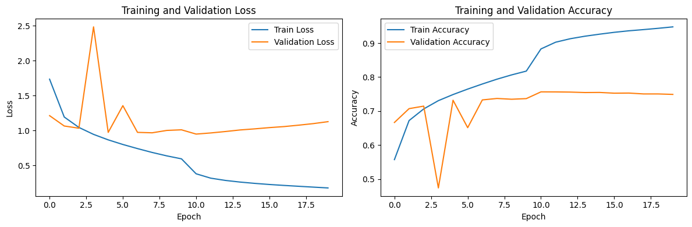

# Quickdraw Classifier

## 개요
EfficientNet-B0 모델을 Google의 QuickDraw 데이터셋으로 파인튜닝하여 손으로 그린 스케치를 분류하는 프로젝트입니다.

## 데이터셋 정보

- 데이터셋: Google QuickDraw Dataset
- 카테고리: 345개 클래스 (사과, 고양이, 자동차 등)
- 데이터 형태: 28x28 픽셀 흑백 이미지
- 총 데이터: 345개 클래스 * 1000장

## 모델 아키텍처

- 베이스 모델: EfficientNet-B0
- 입력 크기: 224x224 (QuickDraw 이미지를 업스케일링)
- 출력: 345개 클래스 분류

## 훈련 결과 시각화

